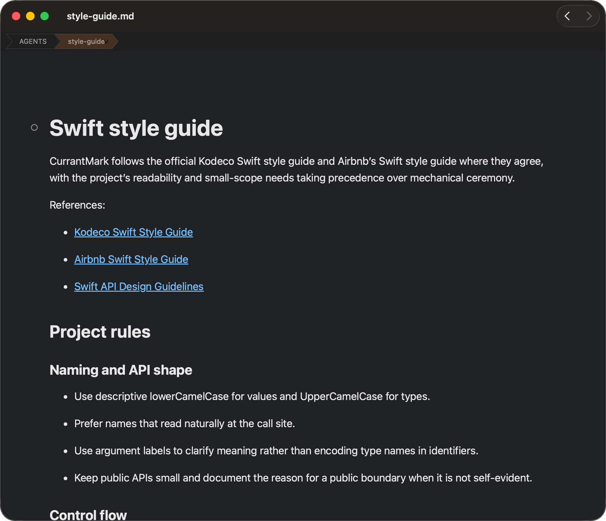

# CurrantMark

CurrantMark is a native macOS Markdown Browser.

> **Project status:** CurrantMark is currently an experiment under active
> design. Feedback and bug reports are welcome, but I'm not accepting external
> pull requests yet.



It opens Markdown
files, follows links between them with Back and Forward navigation, watches the
current file for changes, renders GitHub-Flavored Markdown, and exports the
rendered page to PDF. Find searches the active preview pane. Heading bookmarks
can be toggled from preview gutters,
opened from the Bookmarks menu, and managed in a separate app-wide window. A
document can be split into independently scrollable preview panes without
mixing different documents in one window. Standard browser shortcuts adjust
the rendered page size across both panes. Opening an already-open file focuses
its existing window, while File > Duplicate Window intentionally creates a
separate reading session for the same document.

## Architecture

The app keeps the product flow simple while giving the places that may
reasonably vary a stable seam:

```text
FileDocumentSource -> MarkdownProcessor -> RenderedDocument -> PreviewView
                         ^                                      |
                         |                                      v
                    swift-markdown                         PDFExporter
```

- `DocumentSource` owns reading a document and observing on-disk changes.
- `MarkdownProcessor` turns Markdown into a complete renderable HTML document.
- `RenderedDocument` is the shared model for preview and export.
- `PreviewView` owns the AppKit/WebKit presentation boundary and restores
  the browser scroll offset after a refresh.
- `DocumentPreviewGroup` can present one rendered document in an optional
  second, independently scrollable pane.
- `DocumentNavigationHistory` keeps linked-document navigation independent of
  AppKit and WebKit.
- `BookmarkStore` persists an app-wide, versioned bookmark library as JSON;
  `BookmarkController` supplies the shared actions used by preview, menus, and
  the Bookmarks window.
- `PDFExporter` asks WebKit to print the same rendered HTML used by preview.
- `AppDelegate` and `MainWindowController` are the macOS shell and command
  wiring. Actions are methods on the controller, so a future command palette
  can reuse them without knowing about WebKit.

The Markdown processor is replaceable without changing file loading,
presentation, or export. Styling is supplied to the processor as a
`RenderStyle`, rather than being embedded in view-controller code.

## Build

The project uses Swift Package Manager and has one runtime dependency:
Apple's [`swift-markdown`](https://github.com/apple/swift-markdown), used for
parsing and its GitHub-Flavored Markdown extensions.

```sh
swift build
./Scripts/build-app.sh
open build/CurrantMark.app
```

`swift build` is useful for contributors who only need the executable. The
script wraps it in a normal `.app` bundle with Markdown document type metadata
for Finder and Launch Services.

The packaging script embeds the command-line tool inside the app at
`CurrantMark.app/Contents/Helpers/currantmark`. It can be run directly:

```sh
build/CurrantMark.app/Contents/Helpers/currantmark README.md
```

During development, the shared pipeline is also available through SwiftPM:

```sh
swift run currantmark README.md
swift run currantmark export README.md --pdf /tmp/currantmark-readme.pdf
```

The first command writes the rendered HTML to standard output. The second
exports the same rendered document model used by the GUI preview to PDF.

## Contributing

Keep reusable document and rendering code independent of AppKit where
practical. Add focused tests for parsing, HTML generation, file watching, and
scroll restoration before expanding the UI. Avoid adding an abstraction unless
there is a real alternate implementation or platform boundary behind it.

See [AGENTS.md](AGENTS.md) for repository instructions and
[docs/README.md](docs/README.md) for the architecture, implementation status,
style guide, product scope, and decision records.
